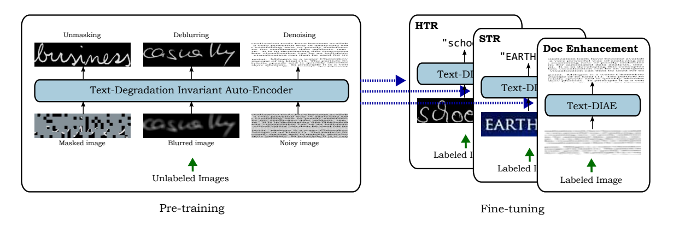

# OCR-TR
## Description
A pytorch implementation of the paper [Text-DIAE: A Self-Supervised Degradation Invariant Autoencoders for Text Recognition and Document Enhancement](https://arxiv.org/abs/2203.04814). The model is 


## Download Code
clone the repository
```bash
git clone https://github.com/dali92002/SSL-OCR
cd SSL-OCR
```
## Setup your environment
Create the following environment named vit with Anaconda. Then, Activate it.
```bash
conda env create -f environment.yml
conda activate vit
```


## Train the model from scratch
To train the model from scratch, use this command ans specify your configs:

```bash
python train.py --data_path ./data/ --img_height 64 --img_width 256 --train_type htr_Augm --batch_size 64 --vit_patch_size 8 
```

Here I specified to use data augmentation for a better training, also I set the image sizes and the vit patch size to be 8x8. You can however use your custom configurations, check Config.py.

During training there will be a validation in each epoch, the best weights will be saved in a folder named ./weights/ and the predictions will be saved in a folder named ./pred_logs/


## Pretraining

For the pretraining of Text-DIAE, use this command and specify the data path and the folder to save your models weights --weights_path

```bash
python pretrain.py --data_path /data/ --weights_path /your_folder/  --img_height 64 --img_width 256 --train_type htr_Augm --batch_size 48 --vit_patch_size 8
```

## Fine tuning the pretrained model

For the fine-tuning of Text-DIAE, use this command and specify the data path, the folder to save your models weights --weights_path and the pretrained encoder to be used --pretrained_encoder_path:

```bash
python  fine_tune.py --data_path /data/users/msouibgui/datasets/vatican/ --pretrained_encoder_path  /your_folder/checkpoint-454_epoch77.pt  --img_height 64 --img_width 256 --train_type htr_Augm --batch_size 128  --vit_patch_size 8
```

## Test the model

To test the model, run the following command. It will recognize the testing data using the trained model, you should specify which model you want to use by profiding its path --test_model:


```bash
python  test.py --data_path /data/ --img_height 64 --img_width 256 --train_type htr_Augm --batch_size 128  --vit_patch_size 8  --test_model ./weights/best-seq2seq_htr_Augm_64_256_8.pt
```

After rnning the testing you will get the predictions in the folder ./pred_logs/ as well as the CER and WER.

## Model Zoo
Coming soon !!

## Citation

If you find this useful for your research, please cite it as follows:

```bash
@inproceedings{souibgui2022text,
  title={Text-DIAE: A Self-Supervised Degradation Invariant Autoencoders for Text Recognition and Document Enhancement},
  author={Souibgui, Mohamed Ali and Biswas, Sanket and Mafla, Andres and Biten, Ali Furkan and Forn{\'e}s, Alicia and Kessentini, Yousri and Llad{\'o}s, Josep and Gomez, Lluis and Karatzas, Dimosthenis},
  booktitle={Proceedings of the AAAI Conference on Artificial Intelligence},
  year={2023}
}

```